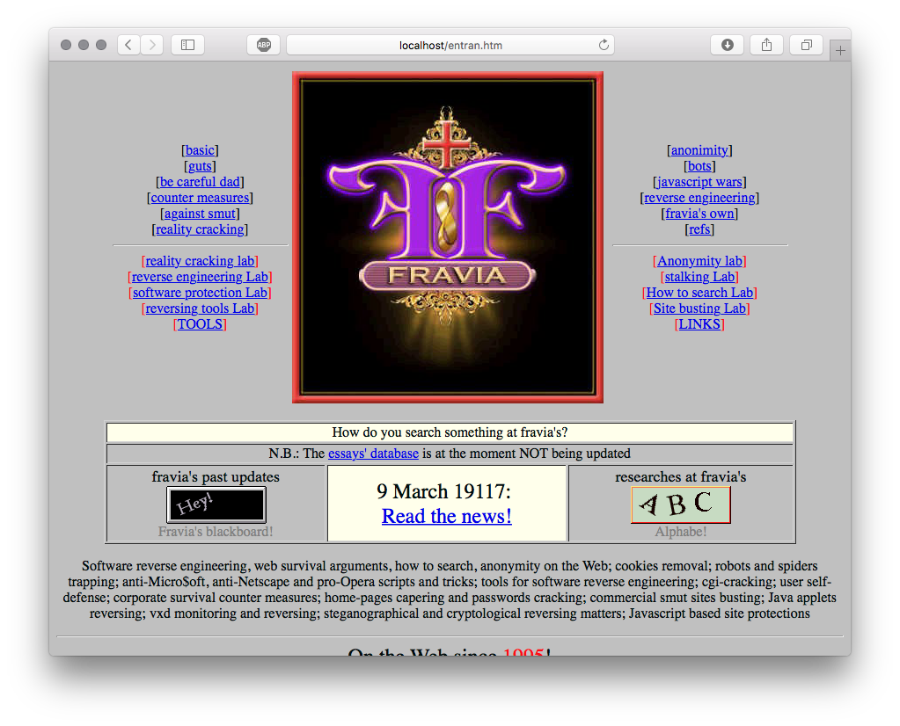

# Fravia's website mirror

Just a mirror of epic Fravia's website, for the sake of old times.

If you want to run a local copy of this website, you can use [docker](https://docker.com)

```
docker run --rm -p 80:80 strm/site-fravia
```

Then go to [localhost](http://localhost) and be nostalgic !



Enjoy !
### Disclaimer

This or previous program is for Educational purpose ONLY. Do not use it without permission. The usual disclaimer applies, especially the fact that me (opsxcq) is not liable for any damages caused by direct or indirect use of the information or functionality provided by these programs. The author or any Internet provider bears NO responsibility for content or misuse of these programs or any derivatives thereof. By using these programs you accept the fact that any damage (dataloss, system crash, system compromise, etc.) caused by the use of these programs is not opsxcq's responsibility.

[](https://hub.docker.com/r/strm/site-fravia/)
